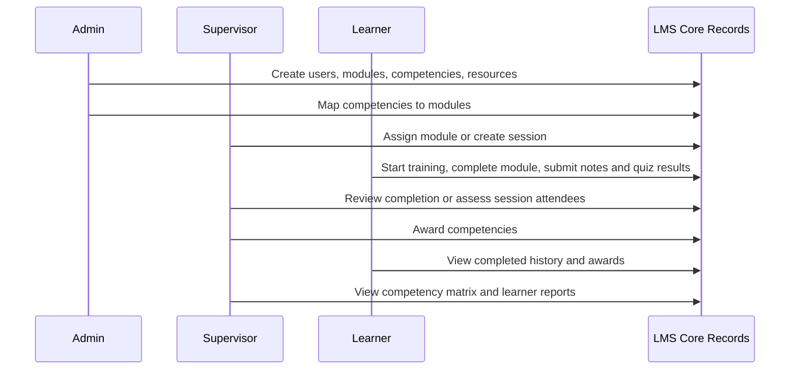

# LMS Functional Hierarchy

This diagram explains what the LMS does from a user interaction perspective. It is organised by access level: shared entry, learner, supervisor, and administrator.

```mermaid
flowchart TB
  lms[McMillan LMS]

  lms --> entry[Shared entry]
  entry --> login[Login]
  entry --> me[Load current user and role]
  entry --> dashboard[Role-specific dashboard]

  lms --> learner[Learner workflow]
  learner --> launchModule[Launch assigned module]
  launchModule --> startProgress[Start or update progress]
  startProgress --> notes[Add learner notes]
  notes --> quiz[Complete module quiz]
  quiz --> submitReview[Submit completion for supervisor review]
  submitReview --> history[Review completed assignments and awards]
  history --> learnerReport[View assigned, in-progress, pending, completed, and awarded counts]

  lms --> supervisor[Supervisor workflow]
  supervisor --> requiredTraining[Required Training]
  requiredTraining --> assign[Assign module to learner]
  requiredTraining --> filterQueue[Filter assignment queue by status]
  requiredTraining --> review[Review learner notes and quiz results]
  requiredTraining --> approve[Acknowledge completion and award mapped competencies]
  requiredTraining --> learnerSummary[Open learner report and completed history]

  supervisor --> sessions[Sessions]
  sessions --> createSession[Create session with module, date, location, and project]
  sessions --> addAttendees[Search and add attendees]
  sessions --> attendance[Mark attendance]
  sessions --> assess[Assess each attendee against mapped competencies]
  sessions --> saveAssessments[Save attendance and assessments]
  sessions --> awardSession[Award competent outcomes]

  supervisor --> reference[Supervisor reference views]
  reference --> modules[Browse training modules by category]
  reference --> competencies[Browse competency catalogue]
  reference --> matrix[View competency matrix and award evidence]

  lms --> admin[Administrator workflow]
  admin --> userMgmt[User Management]
  userMgmt --> createUsers[Create users]
  userMgmt --> editUsers[Edit name, username, email, role, and password]
  userMgmt --> resetPasswords[Reset temporary passwords]
  userMgmt --> deleteUsers[Delete users]

  admin --> moduleMgmt[Module Management]
  moduleMgmt --> catalogue[Choose or create module]
  moduleMgmt --> details[Edit title, category, mode, overview, objectives, duration, resource URL]
  moduleMgmt --> mapCompetencies[Map competencies and evidence types]
  moduleMgmt --> createCompetency[Create competency while building]
  moduleMgmt --> slideBuilder[Build slides: hero, content, bullets, checklist]
  moduleMgmt --> media[Upload/link documents, images, videos, and slide links]
  moduleMgmt --> quizBuilder[Build quiz questions, answers, and explanations]
  moduleMgmt --> preview[Preview learner experience]
  moduleMgmt --> save[Save module and competency mappings]

  admin --> resources[Resources]
  resources --> listFiles[List stored documents and media]
  resources --> openFiles[Open resources]
  resources --> copyUrls[Copy resource URLs]
  resources --> deleteFiles[Delete stored resources]

  approve --> matrix
  awardSession --> matrix
  save --> modules
```

## Functional Levels

### Shared entry

All users sign in, the LMS core confirms their identity and role, and the UI routes them to the correct workflow. The dashboard acts as the launch point for the functionality their role can access.

### Learner Workflow

Learners work through assigned modules in a linear flow: launch the module, update progress, add notes, take the quiz, submit for review, view history, and build their personal learning record.

### Supervisor Workflow

Supervisors manage operational learning. They assign modules to learners, filter and review training submissions, inspect learner reports, approve completed training, and award mapped competencies. They can also run facilitated sessions by scheduling a session, adding attendees, marking attendance, assessing competency outcomes, and awarding competent results.

### Administrator Workflow

Administrators maintain the LMS setup. They manage users and roles, build or edit modules, map modules to competencies, create competencies, upload resources, build slides and quizzes, preview module content, and manage stored files.

## Core Learning Record Flow

