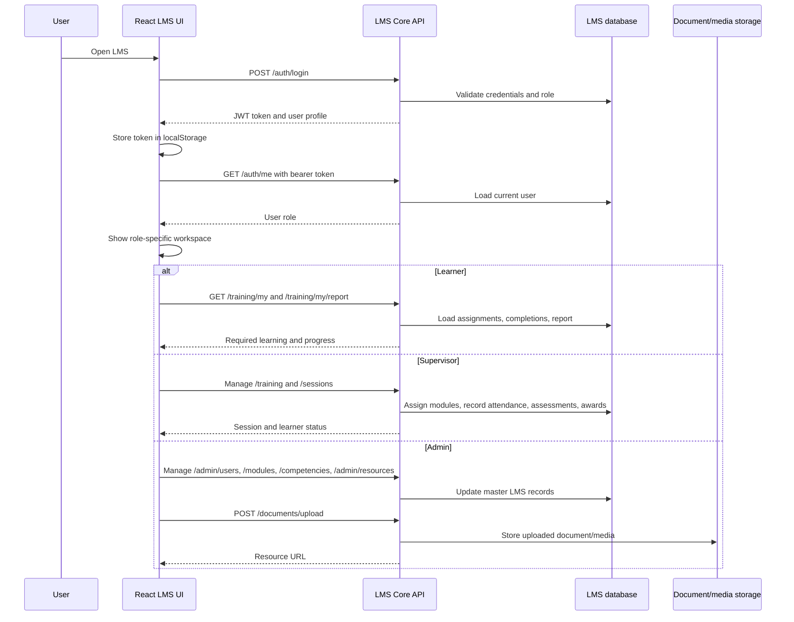

# LMS Software Architecture

This diagram explains how the McMillan LMS UI fits with the backend LMS core. The frontend details come from this repository. Backend services and storage are inferred from the API endpoints consumed by the UI.

```mermaid
flowchart LR
  learner[Learner]
  supervisor[Supervisor]
  admin[Admin]

  subgraph browser[Browser]
    spa[React LMS single page app]
    token[localStorage JWT token]
    routes[Role protected routes]
    player[Module player]
  end

  subgraph delivery[Frontend delivery]
    vite[Vite build]
    nginx[Nginx static server on 8080]
    health[/health endpoint]
  end

  subgraph api[LMS Core API]
    auth[Auth service]
    users[User and role service]
    modules[Module service]
    competencies[Competency service]
    training[Training assignment service]
    sessions[Supervisor session service]
    matrix[Competency matrix/reporting]
    docs[Document/resource service]
  end

  subgraph storage[Backend storage]
    db[(Relational LMS database)]
    files[(Uploaded documents and media)]
  end

  learner --> spa
  supervisor --> spa
  admin --> spa

  vite --> nginx --> spa
  nginx --> health

  spa --> routes
  spa --> player
  spa --> token
  token -->|Bearer token| auth

  spa -->|POST /auth/login, GET /auth/me| auth
  spa -->|GET/POST/PATCH/DELETE /admin/users, GET /users| users
  spa -->|GET/POST/PATCH /modules, module competencies| modules
  spa -->|GET/POST /competencies| competencies
  spa -->|GET/POST /training, review, reports| training
  spa -->|GET/POST /sessions, attendance, assessments, awards| sessions
  spa -->|GET /matrix| matrix
  spa -->|GET/DELETE /admin/resources, POST /documents/upload| docs

  auth --> db
  users --> db
  modules --> db
  competencies --> db
  training --> db
  sessions --> db
  matrix --> db
  docs --> db
  docs --> files
  player -->|contentUrl/imageUrl/videoUrl links| docs
```

## How The LMS Works

Users open the LMS in a browser. The app is a React single page app built with Vite and served as static files by Nginx. Nginx listens on port `8080`, serves the app, caches static assets, and exposes a lightweight `/health` endpoint.

The frontend points to the backend through `VITE_API_URL`, which defaults to `http://lms-core.mcm`. Every normal API request goes through `src/api.js`, which attaches a bearer token from `localStorage` when the user is logged in.

The backend API is the system of record. It authenticates users, checks roles, stores learning records, manages modules and competencies, tracks supervisor sessions, records assessments and awards, and serves uploaded resources or module media.

## Main User Flows



## Backend Responsibilities Shown In The Diagram

- `Auth service`: login, current user lookup, token validation, role enforcement.
- `User and role service`: admin user management plus supervisor learner search.
- `Module service`: learning module metadata, builder content, content URLs, and competency links.
- `Competency service`: competency catalogue used by modules, matrix views, and awards.
- `Training assignment service`: required training, learner progress, supervisor review, and reports.
- `Supervisor session service`: scheduled/group sessions, attendance, assessments, and competency awards.
- `Document/resource service`: uploads and lists resources, module media, PDFs, videos, images, and links.
- `Database`: durable records for users, roles, modules, competencies, assignments, sessions, completions, and audit-friendly reporting.
- `File storage`: uploaded document and media assets referenced by module/resource URLs.

